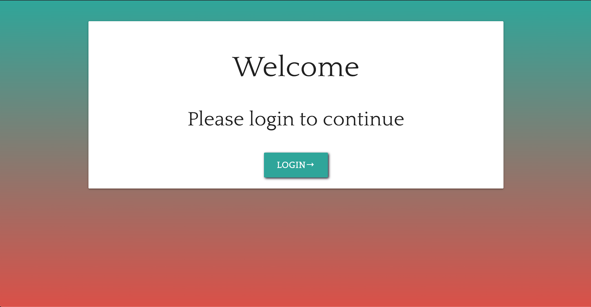
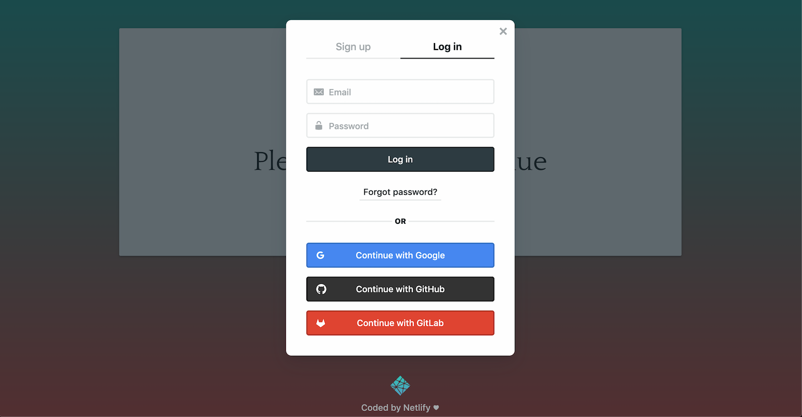
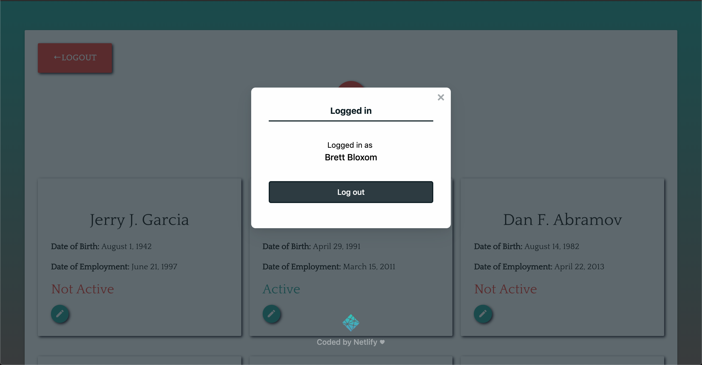
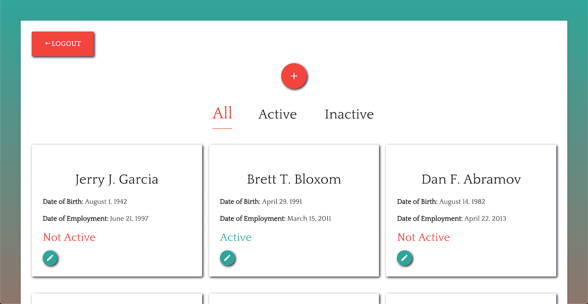
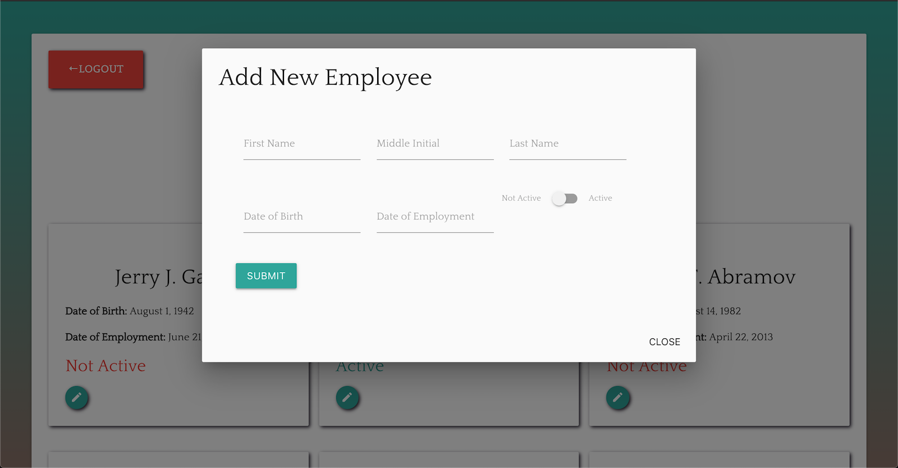
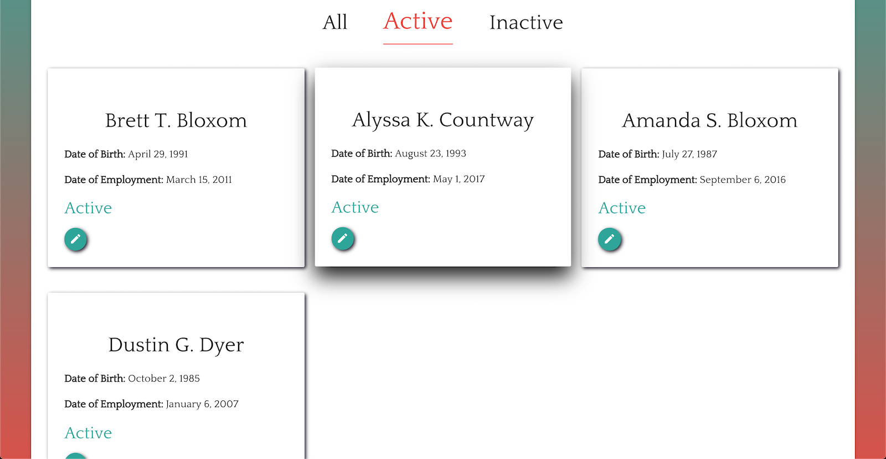
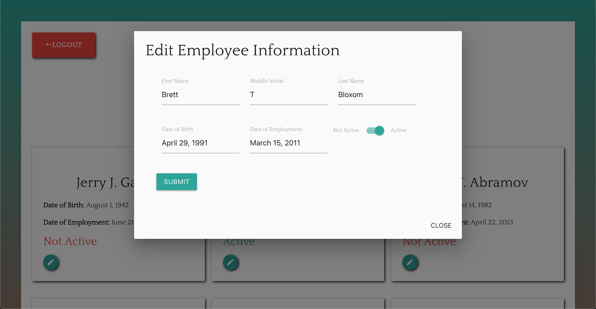

# Brett Bloxom's Front End Challenge

This application was part of the interview/application process for the Associate Contract Developer position at Adattivo in Boulder, CO. 
Applicants are given the choice between either a front end focused application using React and Redux or a backend focused application with Node or Ruby, both with similar functionality. 

#### The application is meant to be an employee management system able to:
- List all employees
- Add new employee
- Update settings of employee
- Deactivate an employee
- Show employee details
- Should also have to login first to the application to do any of the above actions
- Data should be stored in Redux state with default data in place for first run 

### To view the deployed site visit:

[https://adattivochallenge.netlify.com/](https://adattivochallenge.netlify.com/)

This site was deployed using Netlify which offers https out of the box, a custom domain and advanced features for authorizing users with Netlify Identity.

### To run this application locally clone the repo and run:
### `npm install`
#### then
### `npm start`

This runs the app in the development mode. 
Open [http://localhost:3000](http://localhost:3000) to view it in the browser.

The page will reload if you make edits. 
You will also see any lint errors in the console.

## Login 

#### When a user first visits the site, they will be prompted to login or register in order to access the employee page. Currently, anyone can register and login, but restrictions can be made within the Netlify Identity panel. 

## Employee Management Page

#### Once logged in, you will be able to view the employee management page. On this page, a user will first see the initial state from the redux store. Clicking the red button above the list of users will open a modal with a form to add a new user to the list. 

#### Below this button are links for filtering the employees based on their active/inactive status.

#### Within each employee grid item in the list, users can click the green edit button which opens another modal with a form for editing employee information and their status.

